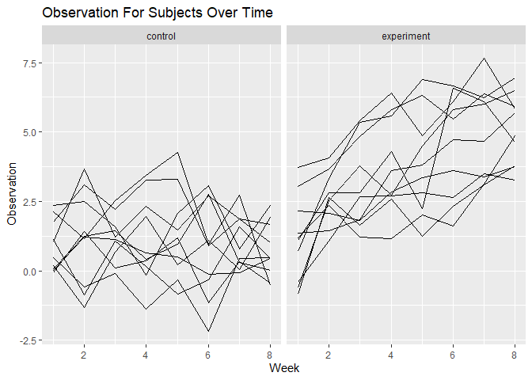

Homework 5
================
Lisa Eisler
11/6/2019

# Problem 1

#### Load IRIS data from the tidyverse

``` r
iris_with_missing = iris %>% 
  map_df(~replace(.x, sample(1:150, 20), NA)) %>%
  mutate(Species = as.character(Species))
```

*The data appears to be measurements of individual iris flowers (petal
and sepal lengths and widths to the nearest 10th of a unit). Included
also are species names.*

#### For numeric variables, you should fill in missing values with the mean of non-missing values. For character variables, you should fill in missing values with “virginica.”

``` r
replace_na = function(x) {
  output = vector(length = length(x))
  for (i in 1:length(x)) {
    if (is.numeric(x[i])) {
      mean_i = mean(x[!is.na(x)])
      if (!is.na(x[i])) {
        output[i] = x[i]
      } else {
        output[i] = mean_i
      }
    } else if (is.character(x[i])) {
      if (!is.na(x[i])) {
        output[i] = x[i]
      } else {
        output[i] = "virginica"
      }
    }
  }
  output
}
iris_complete = map(iris_with_missing, replace_na) %>%
  as.data.frame()
```

# Problem 2

Create a tidy dataframe containing data from all participants in the
experiment, including the subject ID, arm, and observations over time

``` r
filenames = list.files("data")

experiment_data = 
  tibble(
    filenames = list.files("data"),
    directory = str_c("./data/", filenames)
  ) %>% 
  mutate(
    data = map(directory, read_csv)
  ) %>%
  unnest() %>% 
  select(-directory) %>% 
  pivot_longer(
    week_1:week_8,
    names_to = "week",
    values_to = "observation"
  ) %>% 
  mutate(
    arm = substr(filenames, 1, 3),
    arm = recode(arm, "con" = "control",
                      "exp" = "experiment"),
    subject_id = substr(filenames, 5, 6),
    subject_id = as.numeric(subject_id),
       week = substr(week, 6, 7),
    week = as.numeric(week)
  ) %>% 
  select(subject_id, week, arm, observation)
```

Make a spaghetti plot showing observations on each subject over time,
and comment on differences between groups.

``` r
  experiment_data %>% 
  ggplot(aes(x = week, y = observation)) + 
  geom_line(aes(group = subject_id)) + 
  facet_grid(.~arm) +
   labs(
    title = "Observation For Subjects Over Time",
    x = "Week",
    y = "Observation"
   )
```

<!-- -->

*The weekly measurements in the experimental group appear to have
increased over time. The weekly measurements in the control group appear
to have remained stable, perhaps slightly decreasing over time.*

# Problem 3

``` r
sim_regression = function(n = 30, beta0 = 2, beta1){

  sim_data = tibble(
  x = rnorm(n, mean = 1, sd = 1),
  y = beta0 + beta1*x + rnorm(n, 0, sqrt(50))
  )

  ls_fit = lm(y ~ x, data = sim_data)
  
  ls_tidy = broom::tidy(ls_fit) %>% 
    janitor::clean_names()
  
  tibble(
    beta1_hat = ls_tidy$estimate[[2]],
    p_value = ls_tidy$p_value[[2]]
  )
}
```
